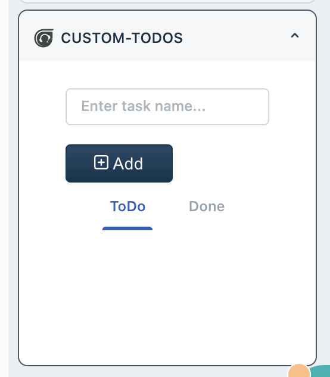

# ToDos app using Custom Objects

A simple ToDos app that uses Custom Objects to store and retrieve ToDos. Kept intentionally simple.

## Key files

- `config/entities.json` - Declares a todo entity
- `app/index.html` - The frontend component's HTML file
- `app/scripts/app.js` - Shows usage of Custom Objects from frontend code.

## Screenshots

