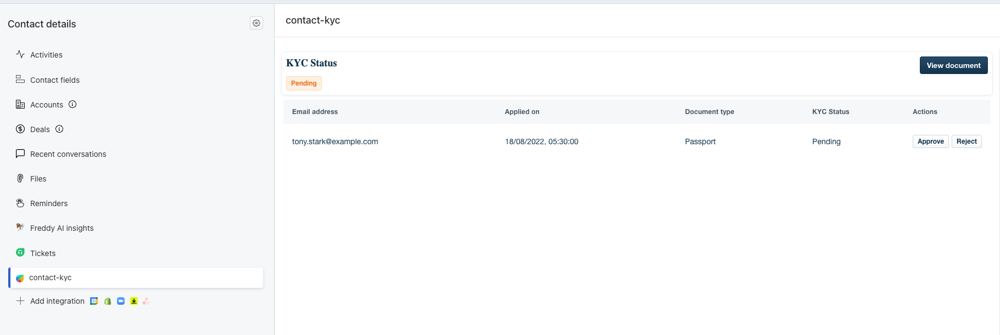
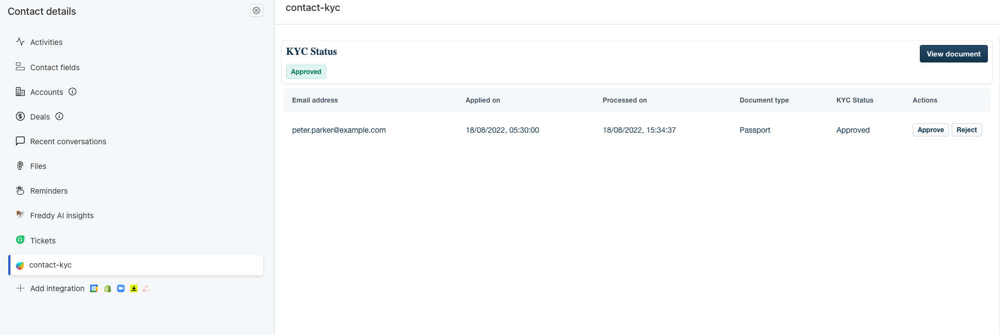
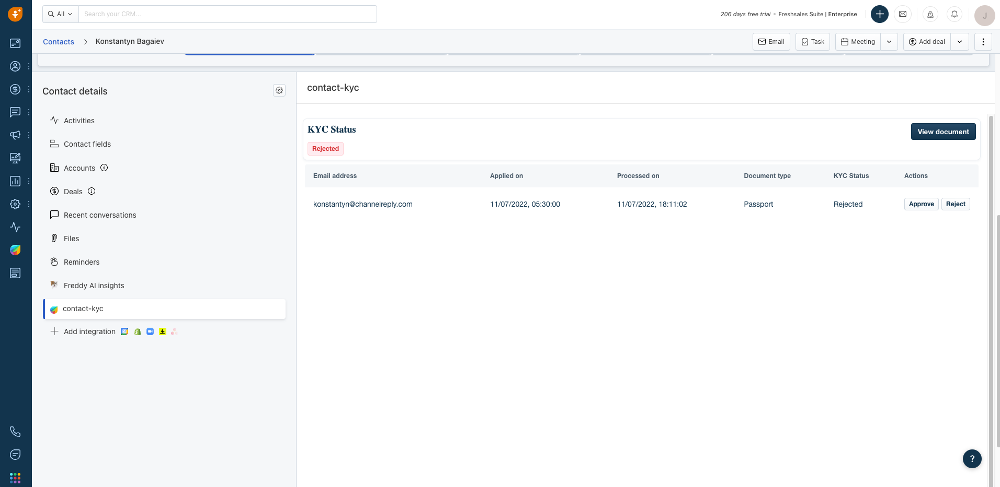
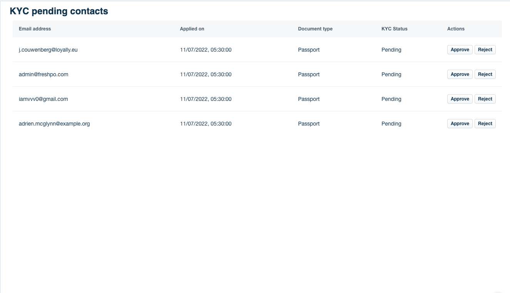

# Freshsales Suite contact KYC status

This app demonstrates Freshsales / Freshworks CRM Suite with entity storage where the KYC record for each contact is created on fly if the record doesn't exists. 

Once the record is created, KYC status is pending where you can either approve it from the [Full-page app](app/kyc_pending_fullpage_app.html) or [Contact Entity menu](app/contact_entity_menu.html). If the KYC record is updated, you can view the details on [Contact Entity menu](app/contact_entity_menu.html).

## Screenshots

### Contact Entity menu

| Description                  | Screenshot                                                                          |
| ---------------------------- | ----------------------------------------------------------------------------------- |
| KYC Status as pending        |        |
| KYC Status as approved       |      |
| KYC Status as rejected       |  |

### Pending Full page app

A full page view showing a table of synced history items.

| Description                              | Screenshot                                                              |
| ---------------------------------------- | ----------------------------------------------------------------------- |
| Full page app showing pending KYC Status |  |
