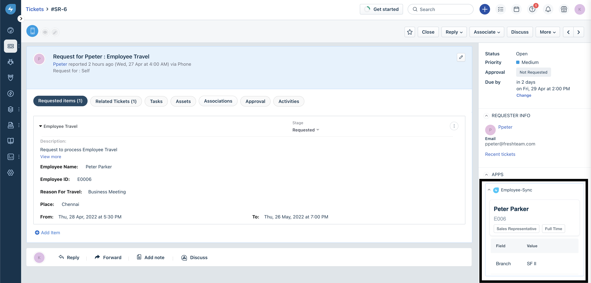
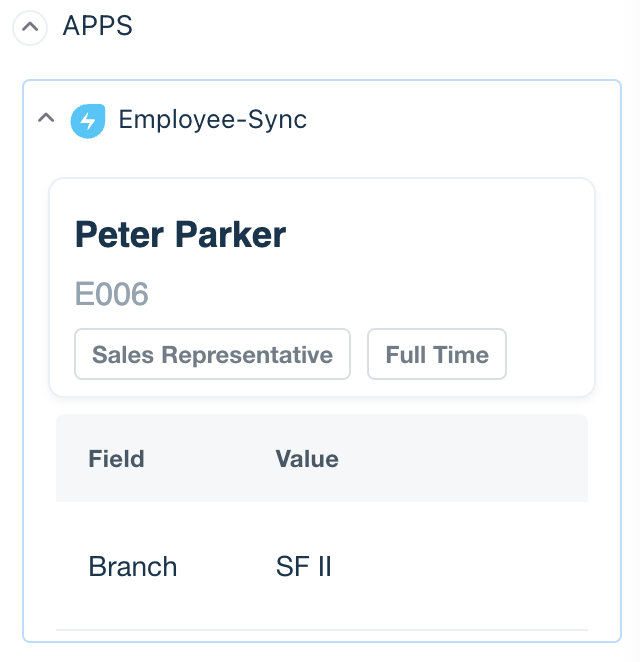
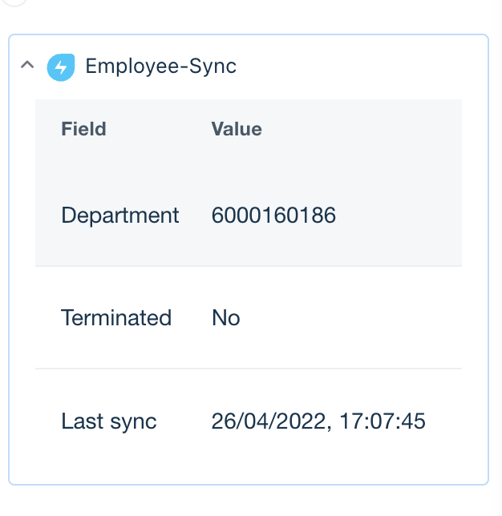

# Freshservice custom objects data-sync app (WIP)

This app syncs employee data from Freshteam and stores that data in Freshservice using Custom Objects.

When an agent views a ticket, this app tries to lookup employee data from the entity store using the requester email address.

A scheduled function syncs list of employees using the Freshteam API on an interval, and updates the entity store.

## Screenshots

Ticket page with app fetching data from custom objects store:

